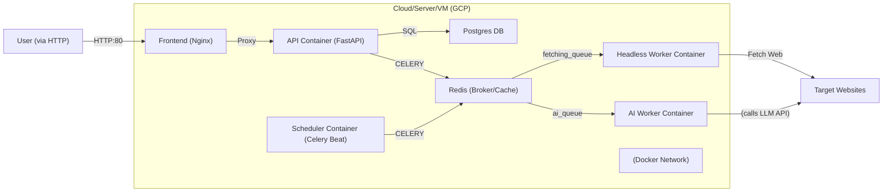

# Deployment & DevOps

## Infrastructure

The system is deployed as Docker containers (API, Redis, Postgres, Workers, Scheduler, Frontend) connected via a Docker network. A high-level deployment architecture:



- **Containers:**
    - **Frontend** (`diploma_frontend`): Nginx serving static HTML/JS/CSS. Exposed on port 80.
    - **PostgreSQL** (`diploma_postgres`): on port 5432. Stores all data. Healthchecks ensure readiness.
    - **Redis** (`diploma_redis`): on port 6379. Acts as Celery broker/back-end and stores rate limit counters.
    - **API Service** (`diploma_api`): on port 8000 (proxied via Frontend). Exposes REST endpoints. Depends on Redis and Postgres (via `depends_on` healthcheck).
    - **Headless Worker** (`diploma_headless_worker`): No host port (internal). Runs Celery worker for page fetching (queue=`fetching_queue`). Uses Playwright; has `shm_size: 1gb` for Chromium.
    - **AI Worker** (`diploma_ai_worker`): No host port. Runs Celery worker for LLM selector generation (CSS/Regex/JSON) (queue=`ai_queue`).
    - **Scheduler** (`diploma_scheduler`): No host port. Runs Celery Beat to enqueue scheduled jobs into Redis.
- **Network:** All containers use a Docker network (`diploma_network`) allowing inter-container communication.
- **Volumes:**
    - `postgres_data` for PostgreSQL persistence.
    - `redis_data` for Redis persistence.

### Environments

| Environment | URL / Access | Branch | Deployment Method |
| --- | --- | --- | --- |
| **Development (Local)** | <http://localhost:8000> (API) | `main` or feature branches | `docker compose up` |
| **Production** | <http://34.76.213.63/> | `master` | Manual via SSH |

## CI/CD Pipeline

> **Note**: Automatic CI/CD pipelines (e.g., GitHub Actions) are currently **disabled** to maintain strict manual control over the deployment process during the active development phase.

- **Deployment**: Performed manually by connecting to the server via SSH, pulling the latest code from `master`, and restarting the Docker Compose stack.
- **Testing**: Tests are run locally or in a pre-commit hook before pushing to the repository.

### Manual Deployment Command
```bash
gcloud compute ssh diploma-backend --zone=europe-west1-b --command="cd ~/diploma && git pull && docker compose up -d --build"
```

## Environment Variables

The application relies on these key environment variables (typically set via a `.env` file):

| Variable | Description | Required | Example |
| --- | --- | --- | --- |
| DB_HOST, DB_PORT | Database connection host/port | Yes | postgres, 5432 |
| DB_NAME, DB_USER, DB_PASSWORD | Database credentials | Yes | diploma_db, app_write, *** |
| REDIS_URL | Redis connection string | Yes | redis://redis:6379/0 |
| SECRET_KEY | Secret key for JWT signing | Yes | yoursecretkey |
| LLM_PROVIDER | Primary LLM service (e.g. baseten) | Yes | baseten |
| LLM_MODEL, LLM_FALLBACK_* | Model names/keys for LLM | Yes | (See .env.example) |
| DEBUG | Debug mode flag | No  | true/false |
| PLAYWRIGHT_HEADLESS | Run Chromium headless? | No  | true |

Secrets such as API keys (`OPENAI_API_KEY`, `GOOGLE_API_KEY`, etc.) are stored in the `.env` file on the production server and are **not** committed to version control.
