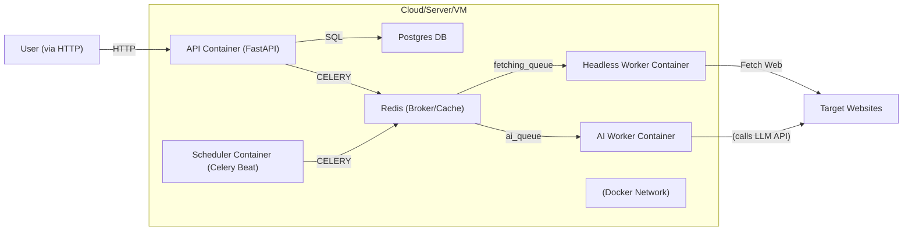

# Deployment & DevOps

## Infrastructure

The system is deployed as Docker containers (API, Redis, Postgres, Workers, Scheduler) connected via a Docker network. A high-level deployment architecture:



- **Containers:**
- **PostgreSQL** (diploma_postgres): on port 5432. Stores all data. Healthchecks ensure readiness.
- **Redis** (diploma_redis): on port 6379. Acts as Celery broker/back-end and stores rate limit counters.
- **API Service** (diploma_api): on port 8000. Exposes REST endpoints. Depends on Redis and Postgres (via depends_on healthcheck).
- **Headless Worker** (diploma_headless_worker): No host port (internal). Runs Celery worker for page fetching (queue=fetching_queue). Uses Playwright; has shm_size: 1gb for Chromium.
- **AI Worker** (diploma_ai_worker): No host port. Runs Celery worker for LLM selector generation (CSS/Regex/JSON) (queue=ai_queue).
- **Scheduler** (diploma_scheduler): No host port. Runs Celery Beat to enqueue scheduled jobs into Redis.
- **Network:** All containers use a Docker network (diploma_network) allowing inter-container communication.
- **Volumes:**
- postgres_data for PostgreSQL persistence.
- redis_data for Redis persistence.

### Environments

| Environment | URL / Access | Branch |
| --- | --- | --- |
| **Development (Local)** | <http://localhost:8000> (API) | main or feature branches |
| **Staging** | (not configured) | develop |
| **Production** | (not deployed) | (N/A) |

Typically, running locally or in a cloud VM via Docker Compose is used. The example above uses localhost as the base.

## CI/CD Pipeline

A CI/CD pipeline (e.g., GitHub Actions) can automate builds and tests on each push:

- **Commit / PR** triggers pipeline.
- **Build**: Check out code, set up Python/Docker environment.
- **Lint**: Run black --check, ruff, etc. to enforce code style.
- **Test**: Run pytest (unit & integration tests) to ensure no regressions.
- **Security Scan**: (Optional) Use tools like \[Bandit/Snyk\] for vulnerability scanning.
- **Build & Push Docker Images**: If on main branch, build Docker images and push to registry.
- **Deploy**: Automated or manual deployment to target environment (could be as simple as docker-compose up --build on a VM).

### Pipeline Configuration (Example: .github/workflows/ci.yml)

```yaml
name: CI/CD Pipeline  
on: [push, pull_request]  
jobs:  
  build-test:  
    runs-on: ubuntu-latest  
    steps:  
      - uses: actions/checkout@v3  
      - name: Set up Python 3.11  
        uses: actions/setup-python@v4  
        with: {python-version: 3.11}  
      - name: Install dependencies  
        run: pip install -r requirements.txt  
      - name: Lint  
        run: |  
          black --check .  
          ruff check .  
      - name: Run tests  
        run: pytest --cov=./
```

## Environment Variables

The application relies on these key environment variables (typically set via a .env file):

| Variable | Description | Required | Example |
| --- | --- | --- | --- |
| DB_HOST, DB_PORT | Database connection host/port | Yes | postgres, 5432 |
| DB_NAME, DB_USER, DB_PASSWORD | Database credentials | Yes | diploma_db, app_write, \*\*\* |
| REDIS_URL | Redis connection string | Yes | redis://redis:6379/0 |
| SECRET_KEY | Secret key for JWT signing | Yes | yoursecretkey |
| LLM_PROVIDER | Primary LLM service (e.g. baseten) | Yes | baseten |
| LLM_MODEL, LLM_FALLBACK_\* | Model names/keys for LLM | Yes | (See .env.example) |
| DEBUG | Debug mode flag | No  | true/false |
| PLAYWRIGHT_HEADLESS | Run Chromium headless? | No  | true |
| (Other PLAYWRIGHT_\*) | (Timeouts/retry settings for headless) | No  | (Defaults as in .env.example) |

Secrets such as API keys (OPENAI_API_KEY, GOOGLE_API_KEY, etc.) should be kept out of source control (use .env or CI secrets). The provided docker-compose.yml references many of these via \${VAR} placeholders.

## How to Run Locally

### Prerequisites

- **Docker & Docker Compose** installed.
- Optional: Python 3.11 (for running without Docker).

### Setup Steps

```bash
# 1. Clone the repository  
git clone https://github.com/marchanyanehu/diploma_v1.git  
cd diploma_v1  

# 2. Copy environment file  
cp .env.example .env  
# Edit .env to configure credentials (database, JWT secret, API keys, etc.)  

# 3. Start services with Docker Compose  
docker-compose up --build
```

This will build images and start all services (Postgres, Redis, API, workers). The API will be accessible at **http://localhost:8000**.

Alternatively, one can run the API directly with Uvicorn (for development):

```bash
pip install -r requirements.txt  
uvicorn services.api.main:app --reload --host 0.0.0.0 --port 8000
```

## Verify Installation

- Open <http://localhost:8000/docs> to see the live API documentation (Swagger UI).
- The root endpoint (GET /) returns basic service info.
- Test health: GET /health and GET /api/v1/health should report service and DB connectivity.
- Try registering a user (POST /auth/register) and creating a task to verify full end-to-end flow.

## Monitoring & Logging

| Aspect | Tool/Approach | Dashboard URL (if any) |
| --- | --- | --- |
| **Application Logs** | Console logs (structured JSON) | (No central dashboard) |
| **Error Tracking** | (Not integrated) | N/A |
| **Performance** | (Not integrated) | N/A |
| **Health Checks** | /health endpoints, Docker healthchecks | (See /health in API) |

Monitoring can be added (e.g., Prometheus, Grafana, or external logging) in future work. Currently, logs can be viewed via docker-compose logs and health endpoints indicate liveness.
