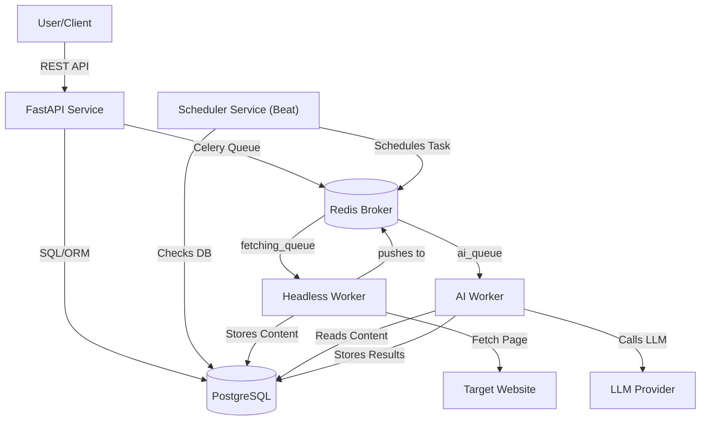

# 2\. Technical Implementation

This section covers the technical architecture, design decisions, and implementation details.

## Contents

- [Tech Stack](tech-stack.md) - Technologies and key decisions.
- [Criteria Documentation](criteria/) - Design rationale for each evaluation criterion.
- [Deployment & DevOps](deployment.md) - Infrastructure setup and deployment instructions.

## Solution Architecture

### High-Level Architecture

_Figure: High-level component interactions in the system._

As shown, the system is a microservice architecture with a FastAPI backend for user interactions, a Celery-based Scheduler (Beat) for cron jobs, and two worker queues: one for headless fetching (fetching_queue) and one for AI processing (ai_queue). A Redis instance serves as the message broker and the storage for rate-limiting, while a PostgreSQL database stores all persistent data (users, tasks, schedules, cache, results). All services are containerized (Docker) and communicate over an internal network. Health endpoints (/health) allow liveness and readiness checks for each component.

### System Components

| Component | Description | Technology |
| --- | --- | --- |
| **API Backend** | Handles authentication and task management (create task, check status/result, schedule jobs). Orchestrates workers via Celery. | Python 3.11, FastAPI, Uvicorn |
| **Celery Workers** | Background services performing: |     |
|  - **Headless Worker**: Fetch web pages using Playwright, extract semantic page text and network data. |     |     |
|  - **AI Worker**: Interpret prompt, generate selectors (CSS/Regex/JSON) via LLM, apply selectors for data extraction. | Python, Celery, Redis, Playwright |     |
| **Scheduler** | Cron-like service (Celery Beat) that enqueues tasks per user-defined schedule in the database. | Python, Celery Beat, Redis |
| **Database** | Central PostgreSQL database for all data: |     |
|  - _Users_: Auth info |     |     |
|  - _ScrapingTasks_: Task metadata and results |     |     |
|  - _ScheduledJobs_: Cron definitions |     |     |
|  - _ParserCache_: Selectors for reuse | PostgreSQL 15, SQLAlchemy ORM |     |
| **Cache/Broker** | Redis used both as a Celery broker/back-end and a short-term cache/rate-limit store. | Redis (In-memory data store) |
| **External LLMs** | Baseten (DeepSeek) as primary provider with Google (Gemini) as fallback. Used to interpret prompts and generate extraction patterns. | Baseten API, Gemini API |

### Data Flow

1.  **User Request:** A client sends a JSON request (url + prompt) to `POST /api/v1/process`.
2.  **Task Creation:** API service validates input, creates a ScrapingTask record (status=PENDING) and enqueues a Celery task to `fetching_queue`.
3.  **Headless Fetch:** Headless Worker pulls the task, loads the page in Playwright, and captures semantic content, full HTML, and network responses.
1.  **Initial LLM Extraction:** 
    *   The system first invokes the **Intelligent Extraction Pipeline** to extract data based on the user's prompt (handling one or many fields). 
    *   **Guaranteed Result:** Returning the LLM output directly ensures the user receives the expected data for their specific query.
5.  **Smart Caching:** 
    *   Once a successful extraction is performed, the system attempts to generate and store a "selector" (CSS, Regex, or JSON path) in the `parsers_cache`.
    *   The cache is indexed by `domain + complete URL + requested fields`.
6.  **Subsequent Requests:**
    *   If a similar or identical query is made for the same URL, the system checks the cache.
    *   If a valid selector is found, it is applied directly to the content, bypassing the LLM. This provides a **10,000x speedup** for repeated queries.
7.  **Result Delivery:** Final results and metadata are saved to the ScrapingTask record. Users retrieve results via `GET /api/v1/result/{task_id}`.

### Multi-Format Selector Caching

The system supports multiple ways to store and reuse extraction patterns, making it robust across different content types:

*   **Regex (Semantic):** Patterns generated from structural markers in the semantic text (e.g., `## [LINK: text]`).
*   **CSS Selectors:** Direct targeting of HTML elements for stable layouts.
*   **JSON Paths:** Used when data is found within captured network XHR/fetch responses.

#### Cache Features:
*   **Field-Based Indexing:** Same patterns reused even if prompts differ (e.g., "get prices" vs. "extract costs").
*   **Self-Healing:** Patterns are validated on each use. If match accuracy drops (e.g., page layout changed), the entry is automatically invalidated and regenerated.

### System Constraints & Limitations

Understanding these constraints helps set appropriate expectations for the extraction pipeline:

1.  **Public Access Only:** Cannot log into websites or bypass paywalls/OAuth.
2.  **No CAPTCHA Solving:** Heavily protected sites (CloudFlare, etc.) may block the headless worker.
3.  **Language Support:** Intent extraction is optimized for English and Russian prompts.
4.  **Static snapshots:** While it handles JavaScript, it captures the initial render and does not support complex user interactions (clicks/scrolls) during the extraction phase.
5.  **Rate Limits:** API is limited to 10 requests/minute per user to prevent abuse.

### Key Technical Decisions

| Decision | Rationale | Alternatives Considered |
| --- | --- | --- |
| **Microservices Architecture** | Allows independent scaling of components (API, workers, scheduler). Improves modularity and maintainability. | Monolithic app (simpler but less scalable) |
| **Python & FastAPI** | Python has rich web scraping and ML libraries; FastAPI offers async support and automatic docs. | Node.js/Express (less mature ML libs), Flask (slower performance) |
| **Celery with Redis** | Proven combo for distributed task queues. Redis is fast, and Celery supports retries and scheduling. | RabbitMQ (more overhead to set up), RQ (less feature-rich) |
| **Playwright for Headless Fetch** | Modern JS support, active browser automation features, and Python integration. | Selenium (heavier, less performant), requests-HTML (no JS) |
| **SQLAlchemy ORM** | Strong support for complex schemas and migrations in Python. Ease of writing queries. | Django ORM (heavy for this project), raw SQL (verbose) |
| **LLM Integration via API** | Leverages state-of-art LLMs (Baseten/DeepSeek + Gemini fallback) for intent interpretation without building our own model. | Building custom NLP models (too time-consuming) |

### Security Overview

| Aspect | Implementation |
| --- | --- |
| **Authentication** | JWT tokens for all protected endpoints (/auth/register, /auth/token, then Bearer tokens). Passwords hashed (bcrypt). |
| **Authorization** | User-specific resources (tasks, jobs) are scoped to the authenticated user (owner_id field). |
| **Rate Limiting** | slowapi (Redis-backed) enforces limits: e.g. /api/v1/process: 10/minute per IP. |
| **Input Validation** | All inputs validated via Pydantic schemas. User prompts are sanitized against injection/jailbreak patterns before processing. |
| **Encryption** | TLS is recommended in production. JWT secret stored in environment (SECRET_KEY), never in code. |
| **Secrets Management** | API keys and database credentials are loaded from environment variables (see .env example) and not hard-coded. |
