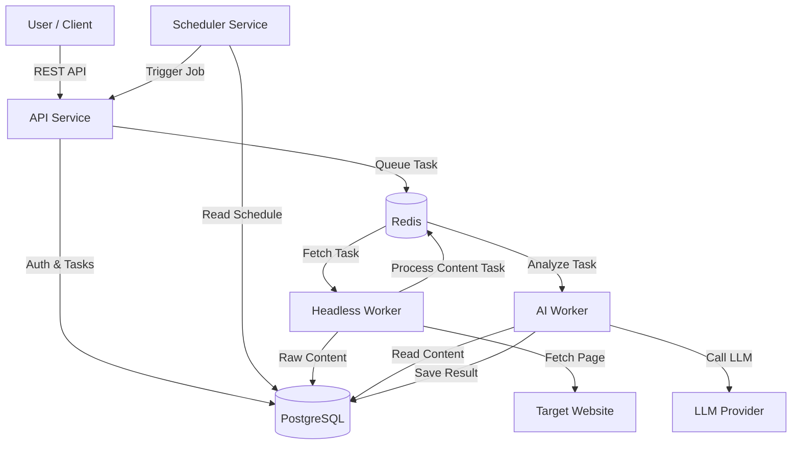

# Architecture Overview

## Microservices Diagram

## Data Flow (Optimized Pipeline)

1.  **Request**: User sends `url` + `prompt` to API.
2.  **Fetch**: Headless Worker navigates to `url`.
    -   Captures `inner_text` (visible) and `html` (structure).
3.  **AI Analysis (AI Worker)**:
    -   **Step 1**: LLM analyzes `inner_text` to find *example values* (e.g., specific prices/titles).
    -   **Step 2**: Worker searches `html` for these example strings to find *candidate snippets*.
    -   **Step 3**: LLM compares candidates to decide which HTML structure is the "canonical" source.
    -   **Step 4**: LLM generates a RegEx based *only* on the chosen snippet.
4.  **Extraction**: Worker applies RegEx to the full content.
5.  **Result**: Structured data is saved to DB.

## Database Schema

-   **Users**: Authentication info.
-   **ScrapingTasks**: Tracks status, raw content, and final results.
-   **ScheduledJobs**: Cron schedules linked to users.
-   **ParserCache**: Stores successful RegEx patterns for reuse (optimization).

