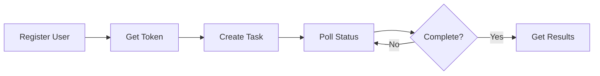
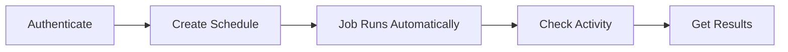

# Intelligent Web Data Aggregator - API Documentation

Welcome to the comprehensive API documentation for the Intelligent Web Data Aggregator. This service enables intelligent web scraping through natural language prompts, powered by Large Language Models (LLMs) and automated regular expression generation.

## 🚀 Quick Start

New to the API? Start here:

1. **[Getting Started Guide](./GETTING_STARTED.md)** - Set up and make your first API call (5 minutes)
2. **[Integration Tutorial](./INTEGRATION_TUTORIAL.md)** - Build a complete integration (30 minutes)
3. **[Interactive Documentation](http://localhost:8000/docs)** - Try the API in your browser (Swagger UI)

## 📚 Documentation Index

### Essential Documentation

| Document | Description | Audience |
|----------|-------------|----------|
| **[Getting Started](./GETTING_STARTED.md)** | Quick setup and first API call | Beginners |
| **[Integration Tutorial](./INTEGRATION_TUTORIAL.md)** | Step-by-step integration guide with working code | All developers |
| **[API Reference](./API_REFERENCE.md)** | Complete endpoint documentation with examples | All developers |
| **[Authentication Guide](./AUTHENTICATION_GUIDE.md)** | JWT authentication, security, and token management | All developers |
| **[Error Handling](./ERROR_HANDLING.md)** | Comprehensive error codes and recovery strategies | All developers |

### Advanced Topics

| Document | Description | Audience |
|----------|-------------|----------|
| **[Best Practices](./BEST_PRACTICES.md)** | Patterns, anti-patterns, and production guidelines | Experienced developers |
| **[Rate Limiting](./RATE_LIMITING.md)** | Rate limit policies and optimization strategies | All developers |
| **[Data Models](./DATA_MODELS.md)** | Complete schema documentation with validation rules | All developers |
| **[Advanced Topics](./ADVANCED_TOPICS.md)** | Pagination, idempotency, batch processing, and more | Advanced users |
| **[Testing Guide](./TESTING_GUIDE.md)** | Contract testing, mocking, and test automation | QA & DevOps |

### System Documentation

| Document | Description | Audience |
|----------|-------------|----------|
| **[Architecture Overview](./ARCHITECTURE_OVERVIEW.md)** | System design, components, and data flows | Architects & DevOps |
| **[Versioning](./VERSIONING.md)** | API versioning strategy and changelog | All developers |
| **[Documentation Strategy](./DOCUMENTATION_STRATEGY.md)** | Documentation approach, tools, and standards | Contributors |

### API Specifications

| Resource | Description | Format |
|----------|-------------|--------|
| **[OpenAPI Specification](../openapi.json)** | Machine-readable API spec | JSON |
| **[Swagger UI](http://localhost:8000/docs)** | Interactive API explorer | Web UI |
| **[ReDoc](http://localhost:8000/redoc)** | Alternative API documentation | Web UI |

## 🎯 Documentation by Use Case

### "I want to..."

**Get started quickly**
- → [Getting Started Guide](./GETTING_STARTED.md)
- → [Integration Tutorial](./INTEGRATION_TUTORIAL.md)

**Understand authentication**
- → [Authentication Guide](./AUTHENTICATION_GUIDE.md)
- → [API Reference - Auth Endpoints](./API_REFERENCE.md#authentication-endpoints)

**Handle errors properly**
- → [Error Handling Guide](./ERROR_HANDLING.md)
- → [Best Practices - Error Handling](./BEST_PRACTICES.md#error-handling)

**Optimize performance**
- → [Rate Limiting Guide](./RATE_LIMITING.md)
- → [Best Practices - Performance](./BEST_PRACTICES.md#performance-optimization)
- → [Advanced Topics - Performance Tuning](./ADVANCED_TOPICS.md#performance-tuning)

**Test my integration**
- → [Testing Guide](./TESTING_GUIDE.md)
- → [Integration Tutorial - Testing Section](./INTEGRATION_TUTORIAL.md#step-8-error-handling-and-best-practices)

**Build production-ready systems**
- → [Best Practices](./BEST_PRACTICES.md)
- → [Architecture Overview](./ARCHITECTURE_OVERVIEW.md)
- → [Advanced Topics](./ADVANCED_TOPICS.md)

**Understand the API design**
- → [Architecture Overview](./ARCHITECTURE_OVERVIEW.md)
- → [Data Models](./DATA_MODELS.md)
- → [Documentation Strategy](./DOCUMENTATION_STRATEGY.md)

## 🌟 Key Features

### Core Capabilities

- **🧠 Natural Language Processing**: Describe data extraction in plain English
- **🤖 AI-Powered Extraction**: LLM-powered data identification and extraction
- **🔄 Automated Regex Generation**: Intelligent pattern creation and validation
- **💾 Smart Caching**: Reuse successful parsers for performance
- **⚡ Asynchronous Processing**: Non-blocking task execution with progress tracking
- **🔐 Secure Authentication**: JWT-based authentication with bcrypt hashing
- **🛡️ Rate Limiting**: Protection against abuse with adaptive throttling
- **📅 Scheduled Jobs**: Cron-based recurring task scheduling
- **🧹 Input Sanitization**: Protection against prompt injection attacks
- **📊 Status Tracking**: Real-time task progress and result monitoring

### Architecture Highlights

- **Backend Framework**: FastAPI (Python 3.11+)
- **Database**: PostgreSQL 15 with SQLAlchemy ORM (3NF normalized)
- **Task Queue**: Celery with Redis backend
- **Authentication**: JWT tokens with 30-minute expiration
- **LLM Providers**: DeepSeek, Gemini, OpenAI via LiteLLM
- **Containerization**: Docker Compose for easy deployment
- **Testing**: Comprehensive pytest test suite

## 🔗 Quick Links

### Development

- **API Base URL**: `http://localhost:8000` (development)
- **Swagger UI**: http://localhost:8000/docs
- **ReDoc**: http://localhost:8000/redoc
- **OpenAPI JSON**: http://localhost:8000/openapi.json
- **Health Check**: http://localhost:8000/health

### Key Endpoints

| Endpoint | Method | Description |
|----------|--------|-------------|
| `/auth/register` | POST | Create new user account |
| `/auth/token` | POST | Get JWT access token |
| `/api/v1/process` | POST | Create scraping task |
| `/api/v1/status/{task_id}` | GET | Check task status |
| `/api/v1/result/{task_id}` | GET | Get task results |
| `/api/v1/jobs` | GET/POST | Manage scheduled jobs |
| `/api/v1/users/me/activity` | GET | Get user activity |

## 📖 Common Workflows

### Basic Scraping Workflow



**Step-by-step**:
1. Register: `POST /auth/register` → Create account
2. Login: `POST /auth/token` → Get JWT token
3. Create task: `POST /api/v1/process` → Submit URL + prompt
4. Check status: `GET /api/v1/status/{task_id}` → Monitor progress
5. Get results: `GET /api/v1/result/{task_id}` → Retrieve data

📝 **Detailed guide**: [Integration Tutorial](./INTEGRATION_TUTORIAL.md)

### Scheduled Jobs Workflow



**Step-by-step**:
1. Authenticate: Get JWT token
2. Create schedule: `POST /api/v1/jobs` → Define cron schedule
3. Automatic execution: System runs jobs per schedule
4. Monitor: `GET /api/v1/users/me/activity` → View tasks
5. Results: `GET /api/v1/result/{task_id}` → Retrieve data

📝 **Detailed guide**: [API Reference - Scheduler](./API_REFERENCE.md#scheduler-endpoints)

## 🔐 Authentication Quick Reference

**Registration**:
```bash
curl -X POST http://localhost:8000/auth/register \
  -H "Content-Type: application/json" \
  -d '{"username":"your_username","password":"your_password","email":"your@email.com"}'
```

**Login**:
```bash
curl -X POST http://localhost:8000/auth/token \
  -d "username=your_username&password=your_password"
```

**Using Token**:
```bash
curl http://localhost:8000/api/v1/health \
  -H "Authorization: Bearer YOUR_ACCESS_TOKEN"
```

📝 **Detailed guide**: [Authentication Guide](./AUTHENTICATION_GUIDE.md)

## ⚠️ Rate Limits

| Endpoint | Limit | Window |
|----------|-------|--------|
| `/auth/register` | 5 requests | per minute |
| `/auth/token` | 10 requests | per minute |
| `/api/v1/process` | 10 requests | per minute |
| All others | 100 requests | per minute |

📝 **Detailed guide**: [Rate Limiting Guide](./RATE_LIMITING.md)

## 🐛 Common Issues

### Authentication Errors

**Problem**: `401 Unauthorized`

**Solutions**:
- Token expired (30-minute limit) → Re-authenticate
- Invalid token format → Check `Authorization: Bearer <token>`
- User not found → Verify username

📝 **Full troubleshooting**: [Error Handling Guide](./ERROR_HANDLING.md)

### Rate Limiting

**Problem**: `429 Too Many Requests`

**Solutions**:
- Implement exponential backoff
- Respect `Retry-After` header
- Use client-side rate limiting

📝 **Detailed strategies**: [Rate Limiting Guide](./RATE_LIMITING.md)

### Task Failures

**Problem**: Task status is `FAILED`

**Common causes**:
- Website blocks scraping → Check URL accessibility
- Prompt too vague → Be more specific
- Timeout → Simplify prompt or retry

📝 **Complete guide**: [Error Handling Guide](./ERROR_HANDLING.md)

## 📊 API Status & Versions

| Version | Status | Released | Support Until | Documentation |
|---------|--------|----------|---------------|---------------|
| v1.0.0 | ✅ Stable | Dec 2025 | Dec 2026+ | You're reading it |
| v1.1.0 | 📅 Planned | Q2 2026 | TBD | Coming soon |
| v2.0.0 | 📅 Planned | Q4 2026 | TBD | Coming soon |

📝 **Version details**: [Versioning Guide](./VERSIONING.md)

## 🤝 Contributing

We welcome contributions to improve the documentation:

1. **Report Issues**: Found an error or gap? [Open an issue](#)
2. **Suggest Improvements**: Ideas for better docs? Let us know
3. **Submit Examples**: Share your integration examples
4. **Fix Typos**: Small fixes are appreciated

📝 **Contribution guidelines**: [Documentation Strategy](./DOCUMENTATION_STRATEGY.md)

## 📞 Support & Contact

### Getting Help

1. **Documentation**: Check guides above
2. **Swagger UI**: Interactive testing at `/docs`
3. **Email Support**: dadada.marchan@gmail.com
4. **GitHub Issues**: Report bugs or request features

### Contact Information

- **Developer**: Yan Marchan
- **Email**: dadada.marchan@gmail.com
- **Project**: Diploma Thesis (Academic Project)

### Response Times

- **Critical Issues**: 24 hours
- **General Questions**: 48-72 hours
- **Feature Requests**: Evaluated quarterly

## 📄 License

This project is part of a diploma thesis and is for academic purposes. The API is provided "as-is" for educational and research use.

**License**: MIT License

## 🗺️ Documentation Roadmap

### Current (v1.0.0)
- ✅ Complete API reference
- ✅ Getting started guide
- ✅ Integration tutorial
- ✅ Authentication guide
- ✅ Error handling guide
- ✅ Rate limiting guide
- ✅ Data models
- ✅ Best practices
- ✅ Testing guide
- ✅ Architecture overview
- ✅ OpenAPI specification

### Planned (Q1 2026)
- 📅 Video tutorials
- 📅 Interactive playground
- 📅 More code examples (JavaScript, Go, Java)
- 📅 Real-world use case studies
- 📅 Performance benchmarks

### Future (Q2 2026+)
- 📅 Documentation portal (Docusaurus)
- 📅 SDK documentation
- 📅 Community examples
- 📅 Localization (Chinese, Spanish)

📝 **Full roadmap**: [Documentation Strategy](./DOCUMENTATION_STRATEGY.md)

---

**Last Updated**: December 14, 2025  
**Documentation Version**: 1.0.0  
**API Version**: 1.0.0

**Navigation**: [↑ Back to Top](#intelligent-web-data-aggregator---api-documentation)