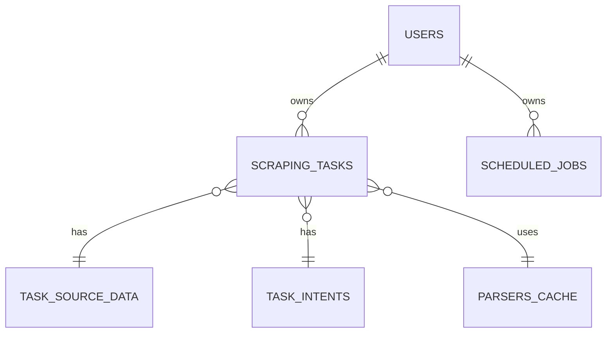

# Database Schema

## Overview

- **Database:** PostgreSQL 15 (managed via Docker container).
- **ORM:** SQLAlchemy (models defined in shared/database/models.py).
- **Schema Management:** Alembic is used for migrations (initial setup and subsequent changes).

## Entity Relationship Diagram

_Figure: Simplified ER diagram showing core relationships (User-Tasks-Jobs, and task dependencies)._

## Tables

### users

Stores user credentials and status.

| Column | Type | Constraints | Description |
| --- | --- | --- | --- |
| id  | INTEGER | PK, AUTOINCREMENT | Unique user ID |
| username | VARCHAR(50) | NOT NULL, UNIQUE | Login name |
| hashed_password | VARCHAR(255) | NOT NULL | Bcrypt hashed password |
| email | VARCHAR(255) | UNIQUE | User's email (optional) |
| is_active | BOOLEAN | DEFAULT TRUE | Whether account is active |
| created_at | TIMESTAMP | DEFAULT NOW() | Account creation timestamp |

**Indexes:** on username, email.

### scraping_tasks

Main table for tracking each scraping task.

| Column | Type | Constraints | Description |
| --- | --- | --- | --- |
| id  | INTEGER | PK, AUTOINCREMENT | Primary key |
| task_id | VARCHAR | UNIQUE, NOT NULL | External task UUID |
| url | TEXT | NOT NULL | Target page URL |
| user_prompt | TEXT | NOT NULL | Original user prompt |
| status | VARCHAR | NOT NULL DEFAULT 'PENDING' | Task status (PENDING/IN_PROGRESS/SUCCESS/FAILED) |
| error_message | TEXT | NULLABLE | Error text if failed |
| extracted_data | JSON | NULLABLE | Final data array (on SUCCESS) |
| total_matches | INTEGER | NULLABLE | Number of items extracted |
| processing_time_seconds | INTEGER | NULLABLE | Time taken (seconds) |
| used_cached_parser | BOOLEAN | NOT NULL DEFAULT FALSE | Whether a cached regex was used |
| created_at, started_at, completed_at | TIMESTAMP |     | Timestamps for creation, start, completion |
| owner_id | INTEGER | FK -> users.id | Ownering user (nullable if anonymous tasks) |
| intent_id | INTEGER | FK -> task_intents.id | Intent details (for query reuse) |
| used_parser_id | INTEGER | FK -> parsers_cache.id | Cached parser used (if any) |

**Relationships:** Each task optionally links to one TaskIntent (normalized prompt data) and one ParserCache entry (if cached regex was used).

### task_intents

Normalizes the components of user prompts. Each task may reference one intent.

| Column | Type | Constraints | Description |
| --- | --- | --- | --- |
| id  | INTEGER | PK, AUTOINCREMENT | PK  |
| target | TEXT | NULLABLE | Main object (e.g. "job listings") |
| keywords | JSON | NULLABLE | Array of keywords |
| schema_fields | JSON | NULLABLE | Array of requested field names |
| constraints | JSON | NULLABLE | Additional conditions (e.g. filters) |
| output_shape | TEXT | NULLABLE | Human-readable description of output |
| normalized_hash | VARCHAR | NULLABLE INDEX | Hash for intent matching |

### task_source_data

Holds large source data for a task to keep scraping_tasks slim.

| Column | Type | Constraints | Description |
| --- | --- | --- | --- |
| id  | INTEGER | PK  | PK  |
| task_id | INTEGER | FK -> scraping_tasks.id (1:1) | Associated scraping task |
| page_content | TEXT | NULLABLE | innerText of page (structured text) |
| html_content | TEXT | NULLABLE | Full HTML of the page |
| network_requests | JSON | NULLABLE | Captured XHR/fetch responses (as JSON) |
| chosen_source_url | TEXT | NULLABLE | URL of content used (if multiple) |

### parsers_cache

Caches successful regex parsers to reuse.

| Column | Type | Constraints | Description |
| --- | --- | --- | --- |
| id  | INTEGER | PK  | PK  |
| url_pattern | VARCHAR | NOT NULL | Pattern (domain or URL regex) |
| domain_id | INTEGER | FK -> domains.id | Foreign key to domains table |
| user_intent | TEXT | NOT NULL | Normalized prompt text |
| intent_keywords | JSON | NULLABLE | Keywords for matching |
| target_data_type | VARCHAR | NULLABLE | e.g. "job_listings" |
| generated_regex | TEXT | NOT NULL | The regex pattern string |
| source_type | VARCHAR | NOT NULL | e.g. "HTML", "JSON", "SCHEMA" |
| source_identifier | TEXT | NULLABLE | e.g. XHR URL or HTML context |
| test_matches_count | INTEGER | NOT NULL | \# of matches found during test |
| confidence_score | INTEGER | NOT NULL DEFAULT 100 | Match percentage (0-100) |
| times_used | INTEGER | NOT NULL DEFAULT 0 | Usage count |
| is_active | BOOLEAN | NOT NULL DEFAULT TRUE | If parser is still valid |
| created_at, last_used_at | TIMESTAMP | DEFAULT NOW() | Timestamps |

Each cached parser links one-to-many to scraping_tasks that used it.

### scheduled_jobs

Stores user-defined cron tasks.

| Column | Type | Constraints | Description |
| --- | --- | --- | --- |
| id  | INTEGER | PK  | PK  |
| url | TEXT | NOT NULL | Target page URL |
| prompt | TEXT | NOT NULL | User's extraction prompt |
| schedule_cron | VARCHAR | NOT NULL | Cron expression |
| is_active | BOOLEAN | NOT NULL DEFAULT TRUE | If the job is active |
| last_run_at | TIMESTAMP | NULLABLE | Timestamp of last execution |
| next_run_at | TIMESTAMP | NULLABLE | Next scheduled run time |
| owner_id | INTEGER | FK -> users.id (NOT NULL) | Owning user |
| created_at | TIMESTAMP | DEFAULT NOW() | Job creation time |

## Relationships

- **User → ScrapingTasks:** One-to-many (a user can have multiple tasks).
- **User → ScheduledJobs:** One-to-many (a user's jobs).
- **ScrapingTask → TaskIntent:** Many tasks can share one intent (the normalized prompt).
- **ScrapingTask → ParserCache:** (Optional) Many tasks can reuse the same parser entry.
- **ScheduledJobs → (ScrapingTask):** Jobs spawn new tasks on schedule (history in separate log table, not shown).

## Migrations

Schema migrations are managed by Alembic. The first migration created all tables above. Subsequent migrations (if any) update columns or add indexes.

## Seeding

No default seed data is required. A test user and tasks can be added via scripts or directly in SQL for testing.
