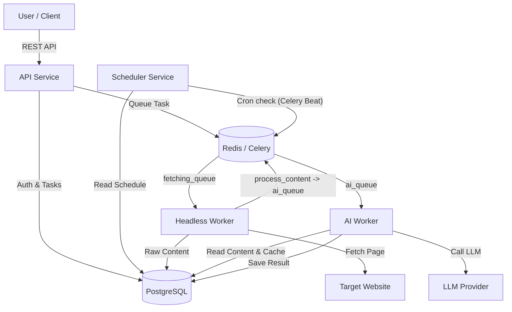
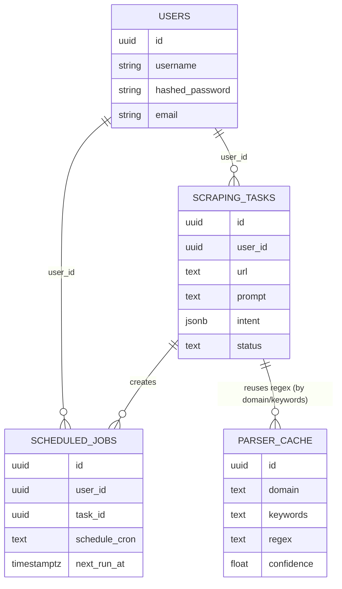
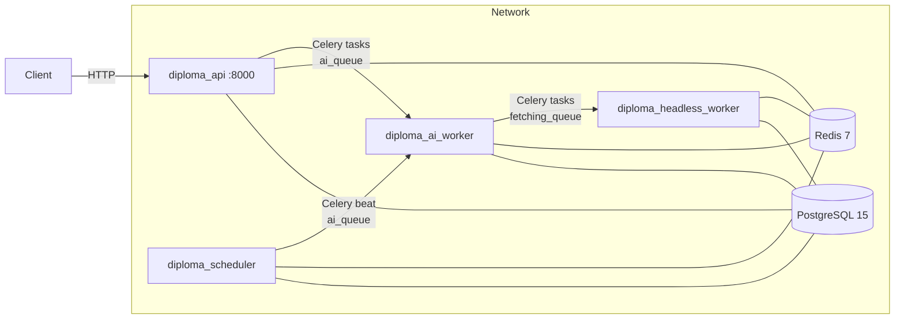

# Architecture Overview

## Microservices Diagram

## Data Flow (Optimized Pipeline)

1.  **Request**: User sends `url` + `prompt` to API.
2.  **Intent Extraction**: AI Worker extracts target, keywords, and schema_fields from prompt.
3.  **Fetch**: Headless Worker (Celery `fetching_queue`) navigates to `url`.
    -   Captures **semantic content** (structured text with role markers: `[LINK:]`, `[BUTTON:]`, `##` headings, `•` lists, `|` tables)
    -   Captures `html` (full page structure) and network requests
    -   Semantic content provides cleaner signal for LLM analysis
4.  **AI Analysis (AI Worker, `ai_queue`)**:
    -   **Step 1**: Check field-based cache with complete URL matching
    -   **Step 2**: If cache miss, determine extraction path:
    -   **Schema Extraction Path** (multi-field requests like "title, price, description"):
        - LLM extracts all fields with proper associations directly from semantic content
        - Returns structured data (source: "schema_extraction") with `fields` property
        - Generates regex from semantic content and validates against LLM output
        - Only caches regexes with ≥60% match rate to ensure quality
    -   **Single-Field Extraction Path** (single keyword):
        - LLM finds *example values* in semantic content (truncated to 32KB)
        - Worker searches `html` for these examples to find *candidate snippets*
        - LLM selects best candidate from snippets (source disambiguation)
        - Extract focused micro-snippets (150 chars) around examples
        - LLM generates RegEx using `services/ai_worker/regex_generation.py`
        - Iterative loop: Generate → Validate → Refine (up to 3 attempts)
    -   **Cache**: Successful, validated regex stored by domain + complete URL + fields for reuse.
5.  **Extraction**: Worker applies RegEx to full content (semantic for cached, full HTML for fresh regex).
6.  **Result**: Structured data saved to DB with `source`, `confidence`, and `fields` metadata.

### Snippet Strategy (Token Optimization)

The system never sends full HTML to the LLM. Instead, it uses semantic content and focused snippets:

| Layer | Size | Purpose |
|-------|------|---------|  
| Semantic content (full) | Unlimited* | Structured text with role markers for regex application |
| Full HTML | Unlimited* | Stored for regex application and snippet extraction |
| LLM semantic prompt | 32KB max | Truncated semantic content for LLM extraction |
| Attribute extraction | 15KB max | HTML snippets for URL/attribute extraction |
| Context snippet | 4000 chars | Fallback for regex generation |
| Micro-snippet | 150 chars | Focused HTML for precise regex |
| Line-aware snippet | 600 chars | Preserves example intact with context |

*Defensive 200KB cap for database storage (per field), but rarely reached in practice.## Module Organization

The system follows microservices architecture with shared infrastructure:

### Shared Modules (`shared/`)

Shared across all services to prevent duplication:

| Module | Purpose | Used By |
|--------|---------|--------|
| **config.py** | Application settings (DB, Redis, LLM, security) | All services, tests, migrations |
| **database/** | Database layer (connection, models, utilities) | All services, tests, migrations |
| **celery_app.py** | Celery configuration and task queues | All workers, scheduler |

Input sanitization lives in `services/ai_worker/input_sanitization.py` and is imported by the API to block prompt-injection attempts before queueing work.

### Database Module (`shared/database/`)

- **`connection.py`**: SQLAlchemy engine, session management, `get_db()` dependency
- **`models.py`**: ORM models (User, ScrapingTask, ScheduledJob, ParserCache, etc.)
- **`utils.py`**: CRUD operations (create_task, get_task, cache lookups, etc.)
- **`__init__.py`**: Central export point for all database components

### Service-Specific Modules

- **`services/api/`**: FastAPI routes, auth, repositories, service layer
- **`services/ai_worker/`**: Intent extraction, regex generation, caching workflows
- **`services/headless_worker/`**: Playwright fetching, semantic content extraction
- **`services/scheduler/`**: Celery Beat scheduled job processing

## Database Schema

-   **Users**: Authentication info (username, hashed_password, email, is_active).
-   **ScrapingTasks**: Tracks status, raw content, intent, and final results.
-   **ScheduledJobs**: Cron schedules linked to users (url, prompt, schedule_cron).
-   **ParserCache**: Stores successful RegEx patterns for reuse (domain, keywords, regex, confidence).

See `reference_docs/DB/data_dictionary.md` for full schema details and ER diagram.

## Services Overview

| Service | Container | Queue | Purpose |
|---------|-----------|-------|---------|
| **API** | `diploma_api` | - | FastAPI REST endpoints, auth, task creation |
| **Headless Worker** | `diploma_headless_worker` | `fetching_queue` | Playwright page fetching |
| **AI Worker** | `diploma_ai_worker` | `ai_queue` | Intent extraction, regex generation |
| **Scheduler** | `diploma_scheduler` | Celery Beat | Enqueue due scheduled jobs |
| **PostgreSQL** | `diploma_postgres` | - | Data persistence |
| **Redis** | `diploma_redis` | - | Task queue broker, rate limit storage |

## API Contracts & Versioning

- Public REST is versioned under `/api/v1/*`; OpenAPI is available at `/docs` (Swagger UI) and `/openapi.json` for contract sharing.
- Exported snapshot lives at `docs_old/openapi.json` (regenerate: `python -c "from services.api.main import app; import json, pathlib; pathlib.Path('docs_old/openapi.json').write_text(json.dumps(app.openapi(), indent=2), encoding='utf-8')"`)
- Async contracts between services are Celery tasks with explicit queues: `ai_queue` for AI Worker, `fetching_queue` for Headless Worker; scheduler publishes to `ai_queue`.
- Health/readiness endpoints: `/health` (liveness) and `/api/v1/health` (liveness + DB check).

## Domain Model & Bounded Contexts

- **Orchestration (API)**: Users, auth, task lifecycle, schedule CRUD. Owns user auth data and task headers.
- **Fetching (Headless Worker)**: Responsible for acquiring page content and semantic text. Writes task source blobs and network traces.
- **Extraction (AI Worker)**: Owns intent parsing, extraction results, and parser cache (regexes, samples, usage counters).
- **Scheduling (Scheduler)**: Owns scheduled jobs and next-run bookkeeping.

> Data storage: A single Postgres instance is used with explicitly owned tables per context to keep operational complexity low for the thesis scope. Each context writes only its own tables; cross-context access is via service APIs/messages (Celery queues). This is an intentional deviation from “DB per service” and documented trade-off; future work is to split schemas or instances when scale justifies it.

### Domain ER Diagram (owned tables per context)

## Resilience & Error Handling (minimal baseline)

- Celery task limits: soft 10m / hard 15m; publish retries with backoff to protect the broker.
- External calls: LLM and Playwright timeouts are configurable via env; task retries inherit Celery backoff.
- Degradation: if Postgres is down, `/api/v1/health` reports `database.disconnected`; API returns clear 5xx with error body. If broker is down, enqueuing fails fast with logged correlation id; clients receive an error instead of hanging.
- Rate limits: API uses `slowapi` to guard endpoints; Redis stores counters.

## Deployment Diagram

## Operational Features

- **Health checks**: API exposes `/health` and `/api/v1/health`; workers and scheduler include container health checks that ping Redis (and Postgres when configured).
- **Correlation IDs**: Incoming requests accept/emit `X-Correlation-Id`; the ID is propagated through Celery headers so logs across API, workers, and scheduler can be stitched.
- **Images per service**: Dedicated Dockerfiles for API, AI worker, headless worker, and scheduler with non-root users and slim bases.
- **Timeouts / retries**: Celery tasks enforce soft/hard time limits (10m/15m) and broker publish retries with backoff. API uses request-level rate limits; OS/network timeouts for LLM/Playwright are configurable via env.

## Technology Stack

| Component | Technology | Version |
|-----------|------------|---------|
| Web Framework | FastAPI | 0.111+ |
| Task Queue | Celery | 5.4+ |
| Message Broker | Redis | 7 |
| Database | PostgreSQL | 15 |
| Browser Automation | Playwright | 1.44+ |
| LLM Abstraction | LiteLLM | 1.52+ |
| Auth | JWT (python-jose) + bcrypt | - |
| Rate Limiting | slowapi | 0.1.9+ |

