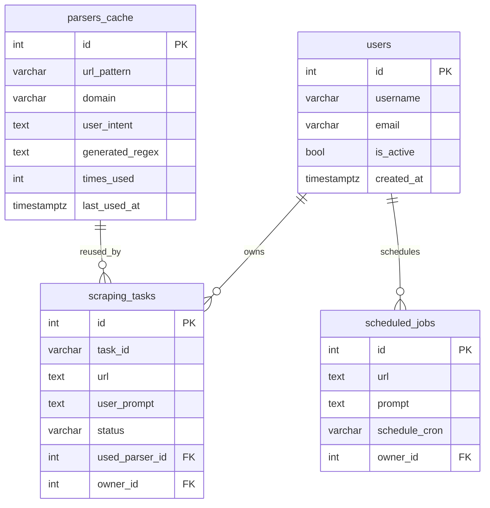

# Data Dictionary & DB Operations

## Tables

- `users`
  - `id` (PK, serial), `username` (varchar(50), unique, not null), `hashed_password` (varchar(255), not null), `email` (varchar(255), unique, null), `created_at` (timestamptz, default now), `is_active` (bool, default true).
- `scraping_tasks`
  - `id` (PK), `task_id` (varchar(255), unique, not null), `url` (text, not null), `user_prompt` (text, not null), status/timestamp fields (`status`, `created_at`, `started_at`, `completed_at`, `processing_time_seconds`, `retry_count`), error/result fields (`error_message`, `extracted_data`, `total_matches`, `page_content`, `network_requests`), parser linkage (`used_cached_parser`, `used_parser_id` → `parsers_cache.id`), intent fields (`intent_target`, `intent_keywords`, `chosen_source_url`, `chosen_source_type`), ownership (`owner_id` → `users.id`, nullable).
- `parsers_cache`
  - `id` (PK), `url_pattern`, `domain`, `user_intent`, `intent_keywords`, `target_data_type`, `generated_regex`, `source_type`, `source_identifier`, validation fields (`test_matches_count`, `confidence_score`, `success_rate`, `times_used`, `is_active`), metadata (`created_at`, `last_used_at`, `created_by_task_id`, `llm_model_used`, `generation_attempts`, `sample_input`, `sample_output`, `normalized_intent_hash`, `keyword_set`).
- `scheduled_jobs`
  - `id` (PK), `url` (text, not null), `prompt` (text, not null), `schedule_cron` (varchar(100), not null), `is_active` (bool, default true), `last_run_at`, `next_run_at`, `owner_id` (FK → `users.id`, not null), `created_at` (timestamptz, default now).

## ER Diagram (Mermaid)

## Integrity & Constraints

- Primary keys on all tables; unique constraints on `users.username`, `users.email`, `scraping_tasks.task_id`.
- Foreign keys:
  - `scraping_tasks.used_parser_id` → `parsers_cache.id`
  - `scraping_tasks.owner_id` → `users.id`
  - `scheduled_jobs.owner_id` → `users.id`
- Default timestamps are UTC (`server_default NOW()`); boolean defaults enforce active rows.
- Engines/indices: per-model indexes added on ids, usernames, emails, owner ids for join performance.
- Consider CHECK/enum for `scraping_tasks.status` (`PENDING|IN_PROGRESS|SUCCESS|FAILED`) if/when stricter enforcement is required.

## Transactions & Integrity Handling

- Request-scope DB sessions via `services/api/database.py#get_db`; commit on success, rollback on exception. Celery tasks reuse the same pattern.
- Referential integrity is enforced in the DB (FKs on owner/parser), avoiding orphaned tasks or schedules.
- Defaults and NOT NULLs capture timestamps/activity flags; app code validates payloads before persistence.
- Trigger `trg_scraping_tasks_parser_usage` (with `bump_parser_usage`) fires only after successful tasks using a parser, updating `times_used` and `last_used_at` to align metadata with runtime behavior.
- Seeds include both success and failure cases to exercise constraints and error paths.

## Index Rationale

- `scraping_tasks.task_id`, `scraping_tasks.owner_id`: task lookup by external ID and per-user views.
- `parsers_cache.domain`, `parsers_cache.url_pattern`, `parsers_cache.normalized_intent_hash`: fast reuse matching by domain/intent/keywords.
- `users.username`, `users.email`: login uniqueness and quick authentication lookup.
- `scheduled_jobs.owner_id`: list schedules per user.
- `parsers_cache.id`, `scraping_tasks.id`: primary key indexes for joins and admin operations.

## Views & Triggers

- View `vw_parser_stats`: aggregates parser reuse (`times_used`, cached hits, success counts) for reporting/defense.
- Trigger `trg_scraping_tasks_parser_usage` + function `bump_parser_usage`: updates `parsers_cache.times_used` and `last_used_at` on successful task completion with a parser.

## Seed & Test Data

- `scripts/db_seed.sql` loads:
  - Demo user (`demo_user` / `Password123!`).
  - Successful parser + successful task (`seed-task-1`) showing cached reuse and populated metrics.
  - Inactive/low-confidence parser for failure illustration (`https://example.com/broken`, `is_active=false`, `times_used=0`, `success_rate=0`).
  - Failed task (`seed-task-failed`) capturing error_message to demonstrate error handling paths.
  - Scheduled job for demo user (nightly cron).
- Seeds are idempotent (ON CONFLICT / NOT EXISTS guards) and rely on roles created via `scripts/db_roles.sql`.

## Setup & Deployment Notes

- Apply schema: `alembic upgrade head` (migrations tracked under `migrations/versions/`).
- Create roles/privileges: run `scripts/db_roles.sql` as `postgres` with provided vars.
- Load seeds: run `scripts/db_seed.sql` as `app_admin`.
- Service creds: use `app_write` in runtime `.env` (see `.env.example`); reserve `postgres/app_admin` for admin tasks only.

## Operational Queries (examples)

- Check parser stats: `SELECT * FROM vw_parser_stats ORDER BY times_used DESC;`
- List recent failed tasks: `SELECT task_id, url, error_message FROM scraping_tasks WHERE status='FAILED' ORDER BY created_at DESC LIMIT 10;`
- Inspect inactive parsers: `SELECT id, domain, url_pattern FROM parsers_cache WHERE is_active=false;`

## Roles & Access

- Superuser (`postgres`) retained for administration only.
- Application roles created by `scripts/db_roles.sql`:
  - `app_read`: `SELECT` only.
  - `app_write`: CRUD on tables (used by services).
  - `app_admin`: full DML/DDL on public schema; inherits `app_write`.
- Privileges are granted via default privileges to cover future tables.

## Migration & DDL

- All schema changes tracked in Alembic under `migrations/versions/`. Latest revision adds `users`, `scheduled_jobs`, and ownership FK on `scraping_tasks`.
- Avoid running `Base.metadata.create_all` in production; prefer Alembic (`alembic upgrade head`).

## Seeds & Test Data

- Run `scripts/db_seed.sql` with `app_admin` to load demo user, sample parser cache, task, and scheduled job. Script is idempotent (checks existing keys).
- Seed password is generated in-DB with bcrypt (`crypt(..., gen_salt('bf'))`); demo login: `demo_user` / `Password123!`.

## Operational Notes

- Set service credentials to `app_write` (see `.env` and `docker-compose.yml`).
- For manual reads use `app_read`; for maintenance use `app_admin` or `postgres`.
- When adding new tables, extend Alembic migrations and update this dictionary.

